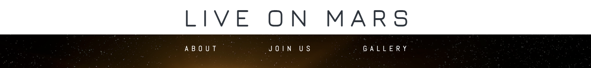
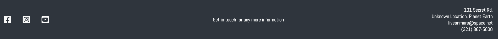

# Live on Mars
Live on Mars is a simple website created for a first portfolio project for Code institute's diploma in full stack software development. It's designed to inspire candidates to leave earth and live on mars, and convince them to join the program. The site includes information about the Live on Mars space program, with clear objectives and launch dates. For those who wish to come on the mission, there is a sign up form. The site's footer includes contact details and it has a seperate gallery page containing images of previous missions.

# UX

The 'Live on Mars' website is minimalistic and clean, designed to seemlesly guide the user from the top of the landing page to the sign up section, after being presented with all the necessary information on the way. The user isn't distracted, instead presented with simple information and inspiring imagery.

# UI

The website is designed to create a sense of awe and inspiration for the user. With the theme of the website being 'space', and therefore mere science-fiction to most people, it made sense to use imagery to draw in the user, which is why images can be found throughout the landing page, and a seperate page is dedicated for the gallery. Navigation links will appear full bordered, and the submit button and address link will change colours when hovered over, promoting an interactive experience between the user and the website.

# Design

**Imagery**

All images used for this website were downloaded from [pexels.com](www.pexels.com)

Because I used landscape positioned images for the main image and contact form images, they didn't need too much styling. However for the about section I styled the image to appear round and bordered to make it more aesthetically appealing. 

In the gallery page, as the images were different sizes, I had to shuffle aorund some of the images so that they would fit nicely within the section without leaving large gaps.

**Fonts**

I wanted the fonts to look futuristic to match the theme of the website. For this reason I chose [Jura](https://fonts.google.com/?query=jura) for the logo, with the letters spaced out. [Abel](https://fonts.google.com/?query=abel) was used for the body of the website, as it look similar to Jura, but offers a bit of variety.

As a back up, sans-serif was chosen incase the user's browser would not support my chosen fonts.

**Colours**

The main colours throughout the website are black and white, keeping with theme. White and black also make for a very clear contrast. Lighter tones are used where it was appropriate for styling.

- #343d46 is applied to all the dark text throughout the website. It's slightly more interesting than plain black, while still readable against a white background. This colour is also used to colour the footer, and some rows of the launch information table.

- #fafafa is applied to all the white text throught the website. It works well against the blackness of space, and helps the clean look I'm trying achieve.

# Features

* **Header & Navigation**

    - At the top of the page, you'll find the website logo/name in the header. The entire width of the header has been made a navigation link to the home page for simplicity. 
    - The 3 navigation links are placed within the section below, and appear to be floating in space, focussing attention to the theme related hero image. When hovered over they will display a full white border for futuristic styling.
    - When clicked, the nav links will take the user to the relevant part of the page. The gallery link directs the user to a seperate gallery page. 
    - The nav links are not visible on the gallery page, instead the user simply clicks the header bar to direct them back home.

* **Landing page image & cover text**

    - The landing page image combines an epic picture taken from space with an exciting text overlay that draws in the user and hints to scroll down for more information about the website.
    - Similar to the navigation links, the cover text appears to be floating in space, purposefully without any borders or background.

* **About**

    - This section of the page provides the user with the why and the when. To the left of the page, the objectives section uses a numbered list to clearly display what potential candidates can expect when they sign up. 
    - The launch information section on the right uses a table which shows the date, time and locations of all the planned missions.
    - Sitting in between the information is styled image of one the rockets from previous missions launching into space.

* **Join us**

    - This section of the page lets the user sign up to the space program. Users won't be able to submit the form without all text fields being filled in the correct format.
    - The form has a theme related background, with slight opacity to keep the form easily readable.

* **Footer**

    - The footer is divided into 3 sections.
    - To the left of the footer are 3 social media icons, taken from Font Awesome, each which take you to their respective links when clicked, in a seperate tab. 
    - The center of the footer gives the user permission to use the contact information displayed on the right side of the footer.
    - The right side of the footer contains all contact information the user may need. The address can clicked to provide instant directions via google maps. Clicking the email address will open the user's default mailing app.

* **Gallery**

    - The gallery is only page seperate to the home page.
    - It displays images from previous missions, giving the user an idea of what it might be like to join.
     

# Deployment

This website has been deployed to GitHub using the following steps:

1. Within the Github repository, navigate to the settings tab.
2. From the source section drop-down menu, select the main branch.
3. Press save to receive a link to the completed website - [Live on Mars](https://axelzwaans.github.io/live-on-mars/)

# Testing

This website has been succesfully tested using Chrome, Firefox and Safari. 

I have also tested the website on various screen sizes for responsiveness, including tablets and phones, to ensure that the media queries achieve the desired result. 

The navigation items direct the user to the requested pages and sections, and data for the 'form' section is downloaded to the server when the submit button is clicked with the text fields filled in.

**Validator Testing**
   
   - HTML
     - I used [The W3C Markup Validation Service](https://validator.w3.org/) to validate the html. No errors were found.

   - CSS
     - I used [The W3C CSS Validation Service](https://jigsaw.w3.org/css-validator/) to validate the CSS. No errors were found.

   - Lighthouse
     - I used Lighthouse to check performance & accessibility. Results are displayed below.

A problem worth mentioning at this point, would be the limitation of the 'float' values, which I used several times in this project. In future projects, I might use the 'flexbox' layout model instead as it allows the developer to arrange items more simply. I found that in this project, floating items make them difficult to visualise, which is especially complicated when working on media queries.

# Credits

**Content**

  - This project is 100% fictional. All information and text displayed written for this project are original.
  - For coding related questions I used [Stackoverflow](https://stackoverflow.com/) and [w3schools](https://www.w3schools.com/)
  - Icons were taken from [Font Awesome](https://fontawesome.com/)
  - Fonts were taken from [Google Fonts](https://fonts.google.com/)

